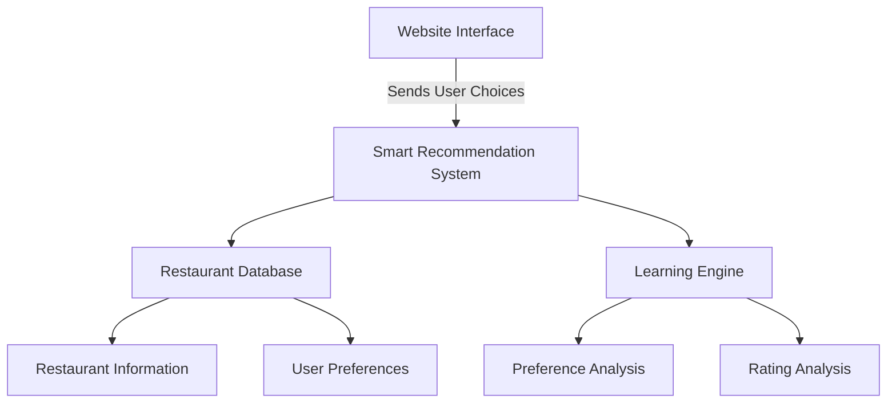

# Restaurant Recommendation System 🍽️

## What is This Project? 
A smart restaurant finder that helps people discover their perfect dining spot in major European cities (London, Paris, Rome). Think of it as a personal dining concierge that learns your tastes and preferences to suggest restaurants you'll love.

### How Does It Help Users?
- 🎯 Personalizes recommendations based on your preferences
- 🌍 Covers thousands of restaurants across London, Paris, and Rome
- 🍳 Considers dietary needs (vegetarian, vegan, gluten-free)
- ⭐ Shows real customer feedback and ratings
- 💨 Quick and easy to use

## How It Works

### For Users
1. Tell us your preferences:
   - Favorite cuisines (Italian, French, Asian, etc.)
   - Dietary requirements
   - Price range
   - Must-have features (like WiFi)

2. Get personalized recommendations:
   - See restaurant photos
   - Read customer feedback
   - Check ratings for food, service, and atmosphere
   - Select your favorites

3. Provide feedback:
   - Rate the restaurants you visit
   - Help improve future recommendations

### Behind the Scenes

The system uses two main parts:

1. **Frontend** (What Users See):
   - Modern, easy-to-use website
   - Beautiful restaurant cards with photos
   - Simple preference selection
   - Built with React and modern web technologies

2. **Backend** (The Brain):
   - Smart recommendation engine
   - Restaurant database
   - User preference storage
   - Built with Python and MongoDB



## Getting Started (For Developers)

### What You Need:
- Node.js (version 18 or newer)
- Python (version 3.8 or newer)
- MongoDB (version 4.4 or newer)

### Setup Steps:

1. **Get the Code:**
   ```bash
   git clone https://github.com/your-org/res-rec-system.git
   cd res-rec-system
   ```

2. **Set Up Backend:**
   ```bash
   cd backend
   python -m venv venv
   source venv/bin/activate  # or `venv\Scripts\activate` on Windows
   pip install -r requirements.txt
   ```

3. **Set Up Frontend:**
   ```bash
   cd ../frontend
   npm install
   ```

4. **Start the System:**
   ```bash
   # In one terminal (Backend)
   cd backend
   flask run

   # In another terminal (Frontend)
   cd frontend
   npm run dev
   ```

### Important Settings:
Create a `.env` file with:
```env
MONGODB_URI=mongodb://localhost:27017/restaurant_db
FLASK_ENV=development
FLASK_APP=app.py
CORS_ORIGIN=http://localhost:5173
```

## Main Features

### Smart Restaurant Discovery
- Uses AI to understand user preferences
- Groups similar restaurants together
- Learns from user choices

### Personalized Experience
- Custom restaurant rankings
- Remembers user preferences
- Adapts to feedback

### User-Friendly Interface
- Easy-to-use design
- Beautiful restaurant photos
- Clear ratings and reviews
- Simple preference selection

## Project Structure

### Frontend (Website):
- `src/components/`: Building blocks of the interface
  - `RestaurantCard.tsx`: Individual restaurant displays
  - `RestaurantGrid.tsx`: Restaurant list layout
  - `ImageSlider.tsx`: Photo carousel
- `src/hooks/`: Helper functions
- `src/types.ts`: Data structure definitions

### Backend (Server):
- `app.py`: Main server code
- `recommendations.py`: Restaurant matching logic
- `api/`: Communication endpoints
- `services/`: Business logic
- `utils/`: Helper functions

## Testing

### For Developers:
```bash
# Test Backend
cd backend
python -m pytest tests/

# Test Frontend
cd frontend
npm test
```

### Quality Checks:
- Automatic code testing
- Code style checking
- Performance testing
- Security verification

## Future Plans
1. Add more European cities
2. Show real-time table availability
3. Add social features (sharing with friends)
4. Connect with booking systems
5. Create mobile app

## Legal & Credits
- MIT License
- Restaurant data from public sources
- Built using open-source software

## Contributing
Want to help improve the project? Here's how:
1. Fork the repository
2. Create your feature branch
3. Make your changes
4. Submit a pull request

Please ensure your changes:
- Include tests
- Update documentation
- Follow code style guidelines
- Are tested locally
